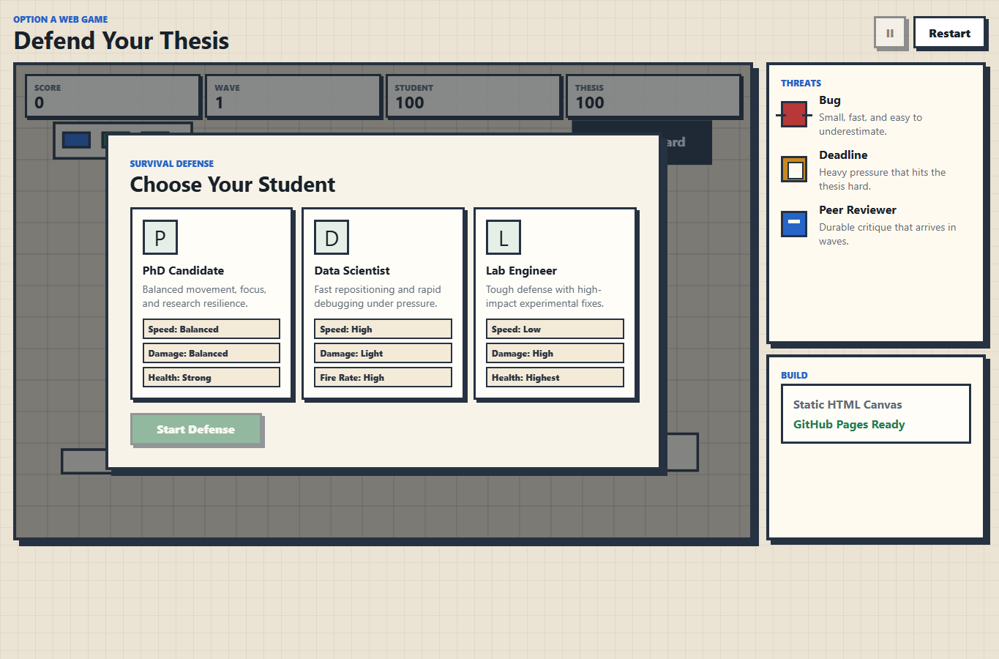
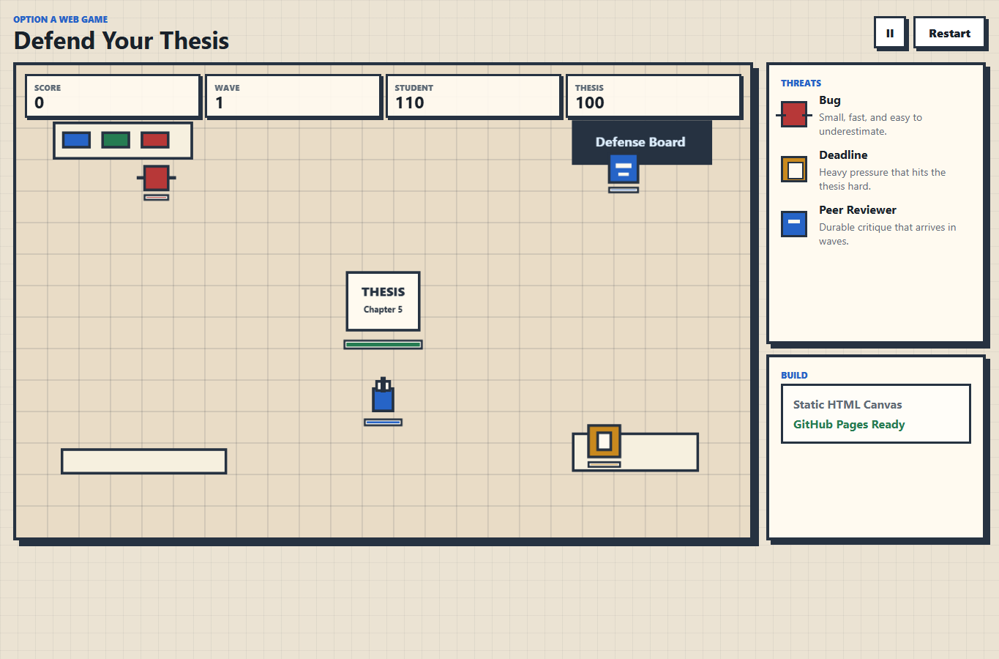
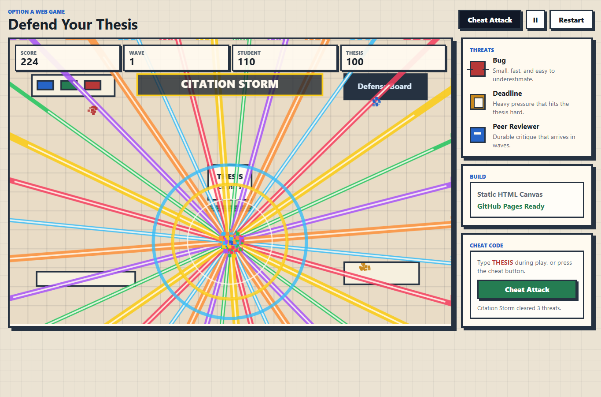
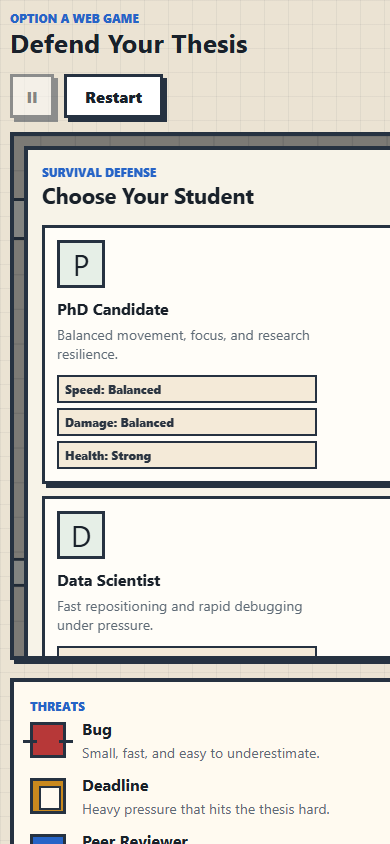

# Defend Your Thesis: Web Game Report

## 1. Background and Design

For this assignment I chose Option A, **Defend Your Thesis**. The goal was to turn the class game idea into a stable and playable web game. The player controls a graduate student who protects a thesis from academic threats: Bugs, Deadlines, and Peer Reviewers.

The design uses a survival-defense loop because it is easy to understand during an in-class presentation and clearly demonstrates functional game logic. The thesis is placed at the center of the map, enemies spawn from the edges, and the player must move, aim, and shoot to survive multiple waves.

The game includes:

- A character selection screen.
- Three student roles with different stats.
- Keyboard movement and mouse shooting.
- Enemy waves, score tracking, health, thesis integrity, pause, restart, and game-over logic.
- A cheat code and cheat button that trigger a special Citation Storm attack.
- A pixel-style academic/lab visual theme.

I did not include the bonus AI assistant because I selected the non-bonus scope. The focus is stability, clear functionality, and deployability.

### Requirement Checklist

<table>
  <thead>
    <tr>
      <th>Assignment requirement</th>
      <th>Implementation evidence</th>
    </tr>
  </thead>
  <tbody>
    <tr>
      <td>Choose one project option</td>
      <td>Option A: <strong>Defend Your Thesis</strong> web game.</td>
    </tr>
    <tr>
      <td>Functional software</td>
      <td>Hosted on GitHub Pages as a playable browser game.</td>
    </tr>
    <tr>
      <td>Character selection page</td>
      <td>Three selectable student roles appear before the game starts.</td>
    </tr>
    <tr>
      <td>Survival/defense mechanics</td>
      <td>The student defends the thesis from Bugs, Deadlines, and Peer Reviewers.</td>
    </tr>
    <tr>
      <td>Keyboard/mouse controls</td>
      <td><code>WASD</code>/arrow movement, mouse aiming, click/hold to shoot, <code>P</code>/Space pause, plus optional cheat code <code>THESIS</code>.</td>
    </tr>
    <tr>
      <td>Game over/score logic</td>
      <td>Score, wave, student health, thesis integrity, restart, and final result screen are implemented in <code>game.js</code>.</td>
    </tr>
    <tr>
      <td>AI-assisted development documentation</td>
      <td>Architecture planning, problem solving, hallucination handling, and documentation workflow are recorded below.</td>
    </tr>
    <tr>
      <td>Screenshots/results</td>
      <td>Screenshots are embedded in the Results section of this report.</td>
    </tr>
    <tr>
      <td>Web deployment</td>
      <td>Public URL: <code>https://rainlikedust.github.io/assignment2/_static/defend-your-thesis/index.html</code>.</td>
    </tr>
    <tr>
      <td>Bonus challenges</td>
      <td>Not attempted; the submitted scope focuses on the required points.</td>
    </tr>
  </tbody>
</table>

## 2. Tech Stack

- Hardware: personal Windows computer.
- Operating system: Windows, tested from PowerShell.
- Runtime: modern desktop web browser.
- Languages: HTML, CSS, and JavaScript.
- Graphics: HTML5 Canvas.
- Build tools: none. The game is a zero-dependency static website.
- Deployment target: GitHub Pages.
- AI development partner: OpenAI Codex/GPT-5 in the Codex desktop environment.

This stack was chosen because GitHub Pages can host static files directly. It also supports cross-platform use because the same webpage can run on Windows, macOS, Linux, and most modern mobile browsers.

## 3. Development Log and AI Assistance

### Architecture Planning

I used the LLM to convert the assignment requirements into an implementation plan. The plan separated the project into:

- `index.html` for the game shell and UI overlays.
- `styles.css` for the pixel-academic visual style and responsive layout.
- `game.js` for gameplay state, input, collision detection, rendering, waves, and scoring.
- `README.md` and `REPORT.md` for documentation and deployment instructions.

The AI recommended a zero-dependency Canvas game instead of a framework. This reduced deployment risk because no package installation or build step is required.

Representative AI interaction:

<table>
  <thead>
    <tr>
      <th>My prompt / task</th>
      <th>LLM contribution</th>
      <th>How I verified it</th>
    </tr>
  </thead>
  <tbody>
    <tr>
      <td>Plan Option A as a deployable web game.</td>
      <td>Proposed a static Canvas architecture with separate HTML, CSS, and JavaScript files.</td>
      <td>Checked the local environment and confirmed that Node.js was unavailable, so the zero-dependency plan was the most stable path.</td>
    </tr>
    <tr>
      <td>Implement movement, aiming, bullets, and collisions.</td>
      <td>Suggested a game loop with player state, enemy state, bullet arrays, and circle-distance collision checks.</td>
      <td>Tested the game in the browser and verified that enemies, bullets, health, score, and waves update correctly.</td>
    </tr>
    <tr>
      <td>Prepare assignment documentation.</td>
      <td>Helped organize the report around background, tech stack, development log, hallucination handling, screenshots, and demo links.</td>
      <td>Compared the report against the assignment rubric and added this checklist plus embedded screenshots.</td>
    </tr>
  </tbody>
</table>

### Gameplay Implementation

The LLM helped design the core game loop:

```text
read input -> update player -> spawn enemies -> move bullets/enemies -> check collisions -> update score/HUD -> draw canvas
```

Specific features implemented with AI assistance include:

- Character stat balancing.
- Pointer-based aiming.
- Bullet/enemy collision detection using circle distance checks.
- Enemy targeting toward the thesis.
- Wave progression and increasing enemy pressure.
- Game-over conditions for both player health and thesis integrity.
- Cheat code handling and a special attack effect using beams, shockwaves, and particles.

### Problem Solving

During planning, the environment was checked first. Node.js was not installed, but Python was available. Because of that, the implementation avoided npm and build tools. The local test path uses:

```powershell
python -m http.server 8000
```

The LLM also helped avoid overengineering. Instead of using external sprites or a complex game engine, the final version draws pixel-style objects directly with Canvas rectangles. This makes the project easier to inspect, explain, and deploy.

### Handling Hallucinations and Errors

The AI sometimes suggests tools or workflows that may not exist on the local machine. I checked the environment before following those suggestions. For example:

- `node` was not available, so I did not use Vite, React, or npm.
- `gh` was not available, so GitHub deployment is documented through normal Git commands and manual GitHub Pages setup.
- Collision and wave logic were kept simple and manually reviewed to avoid fragile generated code.

This process helped keep the final application realistic for the actual computer and assignment conditions.

## 4. Results

The result is a playable static web game located in:

```text
G:\code\SOWTF 3\defend-your-thesis-game
```

Local demo:

```text
http://localhost:8000
```

GitHub Pages demo after deployment:

```text
https://rainlikedust.github.io/assignment2/_static/defend-your-thesis/index.html
```

Live game link:

[Play Defend Your Thesis](https://rainlikedust.github.io/assignment2/_static/defend-your-thesis/index.html)

### Screenshot Evidence

The screenshots below are included directly in the deployed report as proof that the web game runs and renders correctly.

**Character selection screen**



**Gameplay screen with thesis, player, HUD, and academic threats**



**Cheat attack: Citation Storm**



**Mobile-width layout test**



Evidence files:

```text
source/_static/defend-your-thesis/evidence/local-home-screen.png
source/_static/defend-your-thesis/evidence/local-gameplay.png
source/_static/defend-your-thesis/evidence/cheat-attack.png
source/_static/defend-your-thesis/evidence/mobile-home-screen.png
```

The game demonstrates the required features:

- Functional software that runs in a browser.
- Character selection.
- Keyboard and mouse controls.
- Cheat code: type `THESIS` during play, or press the `Cheat Attack` button.
- Survival/defense game logic.
- Score and game-over logic.
- Clear documentation of AI-assisted development.

## 5. Presentation Notes

For the in-class presentation, the recommended flow is:

1. Open the GitHub Pages URL or local server URL.
2. Show the character selection screen.
3. Choose one character and explain the role differences.
4. Demonstrate movement, aiming, shooting, enemy waves, and the `THESIS` cheat code.
5. Let the thesis take damage to show health and game-over logic.
6. Briefly explain how LLMs helped with architecture, bug fixing, cheat attack effects, and documentation.
